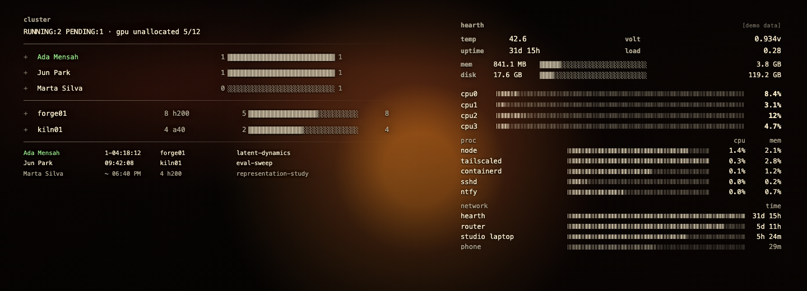
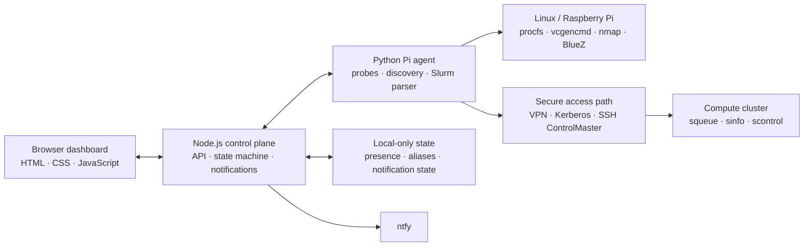

# Hearth

**Hearth is a lightweight Raspberry Pi and compute-cluster observability dashboard that unifies local-device presence, host telemetry, Slurm workloads, notifications and secure remote-access state.**



## Why it exists

Research infrastructure rarely lives in one place. A workstation, a home network, a Raspberry Pi, a private VPN and a Slurm cluster each expose a different fragment of operational state. Hearth turns those fragments into one calm, glanceable instrument panel:

- Raspberry Pi temperature, voltage, load, storage and process telemetry
- LAN presence with deliberately conservative join/leave detection
- Slurm users, queue state, nodes, accelerators, allocations and reported power
- VPN, Kerberos ticket, SSH control connection and scheduler health
- ntfy alerts for meaningful changes rather than every transient probe result

The private deployment runs continuously on a Raspberry Pi. The repository defaults to a fictional, network-inert demo so the complete interface can be reviewed safely anywhere.

## Try the demo

Requirements: Node.js 20 or newer. There are no runtime packages to install.

```sh
git clone https://github.com/rrwwee/hearth.git
cd hearth
npm run demo
```

Open [http://127.0.0.1:4173](http://127.0.0.1:4173). Demo mode:

- binds to loopback only;
- uses in-process fictional fixtures;
- never runs SSH, network discovery or Bluetooth commands;
- disables credential and device-mutation endpoints;
- does not start notifications or write operational logs.

## Architecture



The Node server and Pi agent are intentionally separate. The web process handles policy, state transitions and protected actions; the agent emits bounded JSON snapshots from operating-system and scheduler tools. Demo mode replaces that boundary with fixture functions and cannot reach the real adapters.

## Engineering decisions

1. **Fail-safe demo boundary.** A fresh clone starts in demo mode. Live adapters require `HEARTH_MODE=live` plus explicit agent, state and configuration settings; missing values fail at startup with actionable errors.
2. **Presence is a state machine, not a ping list.** Network observations are debounced across scans, retained as “last seen,” and correlated with nearby Bluetooth changes. This reduces false departures caused by sleeping phones and private-address rotation.
3. **Credentials are handled ephemerally.** Password actions require a protected same-origin request, are accepted only by the Pi-hosted process, and are sent directly to short-lived helpers over standard input. They are neither placed in arguments nor persisted by Hearth.
4. **Remote access repairs itself.** A split-route VPN preserves the overlay-network path while systemd timers renew eligible Kerberos tickets and rebuild stale OpenSSH control connections.
5. **The interface distinguishes allocation from utilisation.** Slurm CPU and memory requests are labelled as allocations, multi-GPU jobs remain one row, unallocated GPUs are not presented as schedulable, and power shows current versus IPMI average without inventing a capacity ceiling.
6. **Job notifications use scheduler accounting.** Hearth uses `squeue` to detect when your jobs start and recent `sacct` allocation records to distinguish successful completion, cancellation and failure states. Notification retries reuse a stable ntfy sequence so a transient delivery problem updates the same alert instead of stacking duplicates.

## Configure a real deployment

Real values belong only in ignored local files. Start with the examples:

```sh
mkdir -p "$HOME/Code/dashboard/config"
cp pi/dashboard/config/hearth.env.example "$HOME/Code/dashboard/config/hearth.env"
cp pi/dashboard/config/cluster.example.json "$HOME/Code/dashboard/config/cluster.json"
cp pi/dashboard/config/devices.example.json "$HOME/Code/dashboard/config/devices.json"
cp pi/dashboard/config/notifications.example.json "$HOME/Code/dashboard/config/notifications.json"
cp pi/dashboard/config/ntfy-server.example.yml "$HOME/Code/dashboard/config/ntfy-server.yml"
```

Replace every example hostname, account, route and URL. Then install or invoke only the capabilities required by that deployment:

```sh
# Pi telemetry and web service
pi/dashboard/install-web-service.sh
pi/dashboard/install-user-timer.sh

# Optional cluster path
pi/dashboard/install-cluster-ssh-config.sh
pi/dashboard/install-kerberos-config.sh
pi/dashboard/connect-cluster-control.sh
pi/dashboard/install-cluster-refresh-timer.sh

# Optional split-route VPN and notifications
pi/dashboard/install-vpn-route-hooks.sh
pi/dashboard/connect-vpn-safe.sh
pi/dashboard/install-ntfy-service.sh
```

For a non-Pi live web process, copy `.env.example` to `.env`, replace its placeholders, and run:

```sh
npm run start:live
```

Validate live configuration without listening, running adapters, writing state or starting notifications:

```sh
HEARTH_MODE=live npm run validate:live
```

## Deploy to a Pi

The live deployment can fetch an exact commit from this public repository while
keeping identifying configuration, operational state and private media outside
Git. The first deployment needs a copy of `pi/dashboard/deploy-from-git.sh` at
`$HEARTH_BASE_DIR/deploy-from-git.sh`. Subsequent deployments update that stable
launcher from the validated release.

On the Pi, a deployment:

1. fetches the requested revision into a non-live repository cache;
2. extracts the exact commit into a versioned release directory;
3. runs the test suite and validates the live configuration;
4. atomically moves the `current` symlink and restarts the user service; and
5. verifies `/api/health`, restoring the prior release if the check fails.

Run a later deployment from another machine with:

```sh
HEARTH_DEPLOY_BASE=/home/pi/Code/dashboard \
  scripts/deploy-to-pi.sh pi-dashboard origin/main
```

The Pi reports the running commit from `/api/health`. Releases live under
`$HEARTH_BASE_DIR/releases`; configuration and state remain under
`$HEARTH_BASE_DIR/config` and `$HEARTH_BASE_DIR/state`. A private background
video may be stored at `$HEARTH_BASE_DIR/private/public/background.mp4` and is
linked into each release without entering Git.

The optional household video is intentionally not distributed. A private deployment may place a licensed `public/background.mp4`; the public demo uses the built-in CSS hearth treatment when it is absent.

## Security and privacy model

- Real device aliases, addresses, notification topics, infrastructure hosts and account identifiers are ignored.
- Example networks use documentation-only address ranges and `.invalid` hostnames.
- Operational state, caches, logs, credentials and local media are excluded from Git.
- Demo mode cannot execute live adapters even if live-looking environment variables are supplied.
- Device naming, diagnostics and password actions require a secure local/overlay source and same-origin requests in live mode.
- Before publication, create a clean public history and scan that history independently; sanitising only the latest commit is insufficient.

The examples document structure, not production policy. Review SSH, sudo, VPN, reverse-proxy and ntfy access controls for the environment where Hearth is deployed.

## Technology

Node.js with no runtime dependencies; browser-native JavaScript and CSS; Python 3; Bash and systemd; Linux procfs and Raspberry Pi tooling; nmap and BlueZ; Slurm; OpenSSH ControlMaster, Kerberos/GSSAPI, an overlay network, a split-route VPN and ntfy.

## Verification

```sh
npm test
npm run check
```

The checks cover fixture shape, demo API behaviour, disabled credential actions, fail-closed live configuration, JavaScript syntax and a redacted scan of the proposed public tree.

## License

Hearth is available under the [MIT License](LICENSE).
